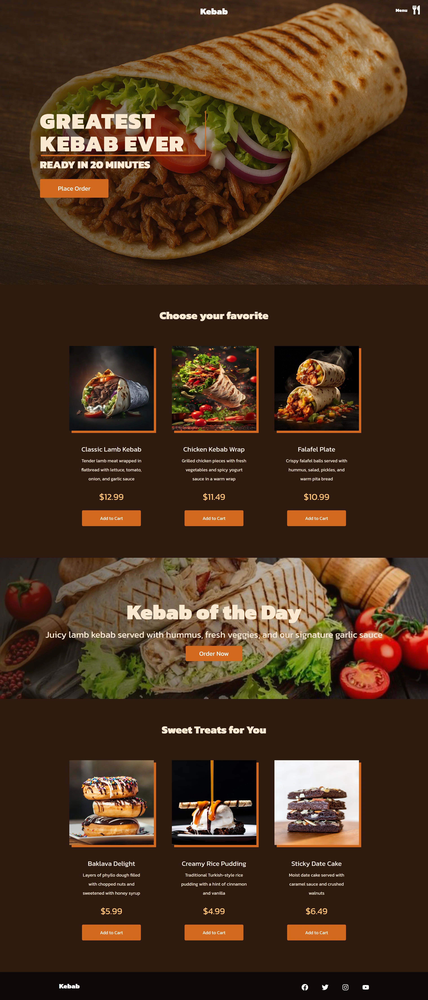

# Kebab-Project-React 

> 🚀 **Modern Restaurant Website with React** - Build responsive online menu and shopping experiences for food service

## 📋 Description

Welcome to the **Kebab-Project-React** repository! This project showcases a fully responsive, modern online menu and shopping experience for a kebab restaurant. The focus is on intuitive design, dynamic interactions, and seamless cart functionality using cutting-edge React technologies.

This repository demonstrates best practices in React development for food service applications, featuring interactive menu systems, shopping cart functionality, and modern restaurant website design patterns.

## 📁 Repository Structure

```
Kebab-Project-React/
├── 📁 public/           # Static public files and assets
├── 📁 src/
│   ├── 🖼️ assets/       # Images and static assets
│   ├── ⚛️ components/   # Reusable React components
│   ├── 📄 pages/        # Different pages (Home, Menu, Cart)
│   ├── 🎨 styles/       # Global and modular SCSS styles
│   └── 💻 App.js        # Main application entry point
├── 📦 package.json      # Project metadata and dependencies
└── 📖 README.md         # Project documentation
```

## 🚀 Getting Started

### 1. Clone the Repository

```bash
git clone https://github.com/dawidolko/Kebab-Project-React.git
cd Kebab-Project-React
```

### 2. Install Dependencies

```bash
npm install
```

### 3. Start Development Server

```bash
npm start
```

- Open your browser and navigate to [http://localhost:3000](http://localhost:3000)

## ⚙️ System Requirements

### **Essential Tools:**

- **Node.js** (version 14.0 or higher)
- **npm** or **yarn** package manager
- **Modern Web Browser** (Chrome, Firefox, Safari, Edge)
- **Git** for version control

### **Development Environment:**

- **Code Editor** (VS Code, WebStorm, Sublime Text)
- **React Developer Tools** browser extension
- **Node.js debugging tools**

### **Recommended Extensions:**

- **ES6/React** syntax highlighting
- **Sass/SCSS** support
- **Prettier** for code formatting
- **ESLint** for code quality
- **Auto Rename Tag** for JSX editing

### **React Ecosystem:**

- **React** (latest version)
- **React DOM** for rendering
- **React Scripts** for build configuration
- **SCSS/SASS** for styling

## ✨ Key Features

### **🍽️ Interactive Menu Shop**

- Browse wide selection of kebab meals: wraps, plates, vegetarian options, sides, and extras
- Detailed descriptions, prices, and high-quality images for each meal
- Dynamic cart with real-time updates and seamless checkout experience

### **🥙 Food Services Section**

- Organized by categories with smooth navigation
- Additional options including drinks, sauces, and combo meals
- Category-based filtering for easy menu browsing

### **📱 Responsive Design**

- Fully optimized for mobile, tablet, and desktop browsing
- Modern React responsive patterns and mobile-first design

### **⚡ Dynamic Frontend Experience**

- Advanced category filters and search functionality
- Interactive buttons and smooth animations for better user engagement
- Real-time cart updates and product management

### **🎨 Modern Aesthetic UI**

- Component-based React structure for scalability
- Modular SCSS/SASS architecture for maintainable styling
- Clean, modern design focused on food presentation

## 🛠️ Technologies Used

- **React** - Component-based frontend framework
- **JavaScript (ES6+)** - Modern JavaScript features and logic
- **CSS3/SCSS/SASS** - Advanced styling and responsive design
- **Git** - Version control and collaboration
- **NPM** - Package management and dependency handling

## 🌍 Live Demo

The project is deployed and available at: **[https://kebab.dawidolko.pl](https://kebab.dawidolko.pl)**

## 🖼️ Preview

[](src/images/full-screen.webp)

## 🤝 Contributing

Contributions are highly welcomed! Here's how you can help:

- 🐛 **Report bugs** - Found an issue? Let us know!
- 💡 **Suggest improvements** - Have ideas for better features?
- 🔧 **Submit pull requests** - Share your enhancements and solutions
- 📖 **Improve documentation** - Help make the project clearer

Feel free to open issues or reach out through GitHub for any questions or suggestions.

## 👨‍💻 Author

Created by **Dawid Olko** - Developed as part of the **Kebab House** web project.

## 📄 License

This project is open source and available under the [MIT License](LICENSE).

---
